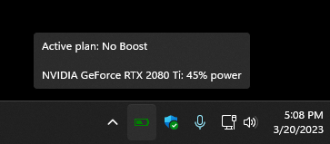
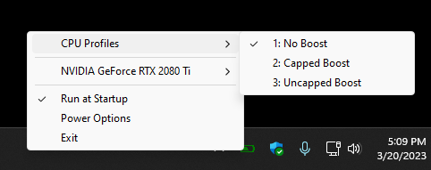
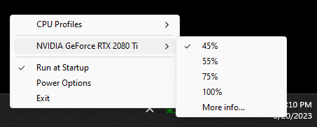
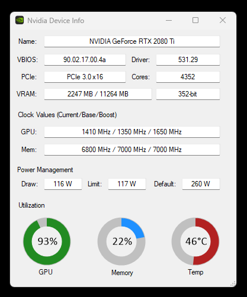

# Power Plan Switcher

*Switching between power plans on Windows was never easier.*

This is a fork of https://github.com/MouthlessGames/powerplanswitcher, a nifty little tool that runs as a system tray application in the background and allows for a quick switching between power plans that are configured in Windows.

For example, you can configure a power saver plan that reduces the CPU speed to 5% (as can be seen in the gif below) and quickly switch to it whenever you want to save some battery power.

Please note that the main and only purpose of this tool is to *switch* between plans and not to *configure* them. This has to be done beforehand in the Power Options menu in Windows.

## Keyboard shortcuts

Power Plan Switcher will attempt to register global keyboard shortcuts for each of your power profiles when it starts up using the key combination <kbd>Alt</kbd>+<kbd>Shift</kbd>+<kbd>1-9</kbd>.
The ordering of the shortcuts is based on the ordering of your profiles in the Windows power profile menu, and the indices are shown in the context menu as a prefix (see the screenshot below).

Unfortunately, there's not a great way to re-order profiles. For now the easiest option is to re-name your profiles to reflect the order that you'd like, then set them up appropriately. Use
[powercfg](https://learn.microsoft.com/en-us/windows-hardware/design/device-experiences/powercfg-command-line-options) to perform the renaming.

## Screenshots

## License

Original code is copyright &copy; 2016-2021 MouthlessGames

Crafted with &hearts; in 2016.

***

Modifications in this fork are copyright &copy; 2023 cadewey

***

Licensed under the GNU General Public License, Version 3.0. See [LICENSE.md](LICENSE.md) for details.

    https://www.gnu.org/licenses/gpl-3.0.txt

The battery icon is from iconsDB.com and is licensed under CC0 1.0: https://www.iconsdb.com/green-icons/battery-icon.html
